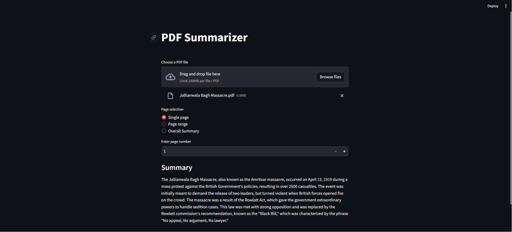

# 📄 PDF Summarizer

## Description
This PDF Summarizer project aims to address the need for efficiently
summarizing PDF documents, making it easier for users to extract key
information from lengthy texts. The primary objectives of the project are to
develop a user-friendly interface for uploading PDF files, selecting specific
pages or ranges for summarization, generating summaries using advanced
natural language processing techniques, and enabling question-answering
functionality based on the content of the documents.

The system is built with the aim of summarising a PDF file uploaded by the user. This system was created using Streamlit, LangChain, and OpenAI frameworks.

## Preview
To be able to see a preview of this system, please see the following link: https://pdf-summarizerr.streamlit.app/,  or check out the preview below.




## Technologies used

Python

Streamlit

PyPDF2

Langchain

Hugging Face Transformers

OpenAI API
## How to Use
In the lines of program code below, change ``OPENAI_API_KEY`` to match your OPENAI API KEY. 

```bash
openapi_key = "YOUR OPENAPI KEY"
```
Clone the repository:
```bash
git clone https://github.com/your-username/pdf-summarizer.git

```
Navigate to the project directory:
```bash
cd pdf-summarizer
```
Install dependencies:
```bash
pip install -r requirements.txt
```
Run the application:
```bash
streamlit run app.py
```


